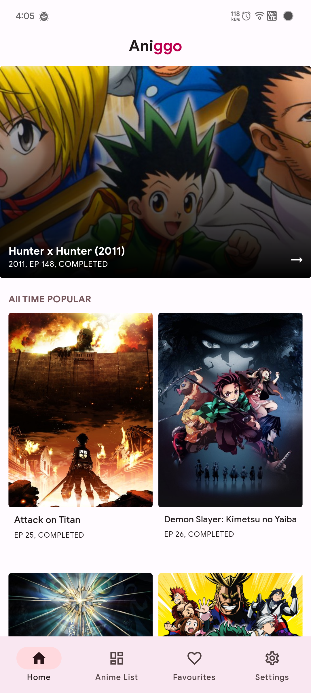
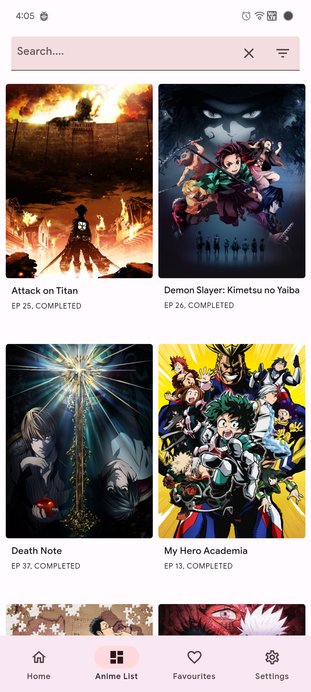
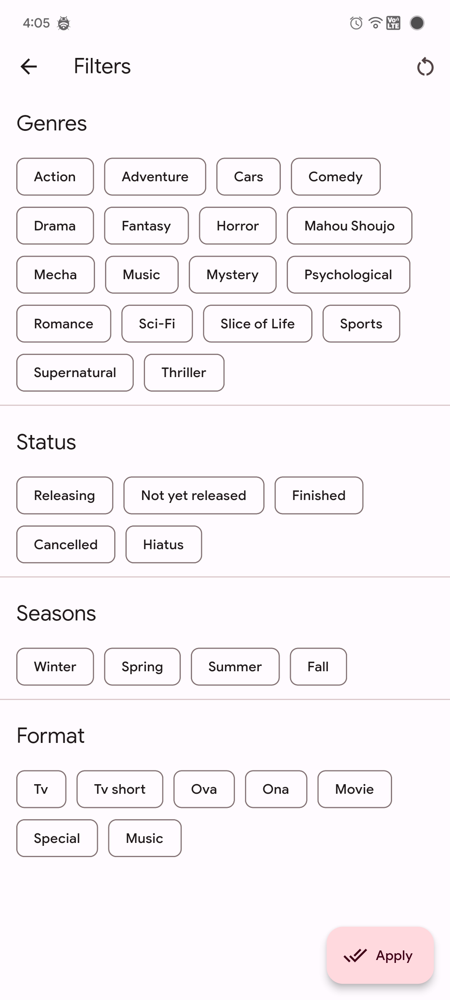
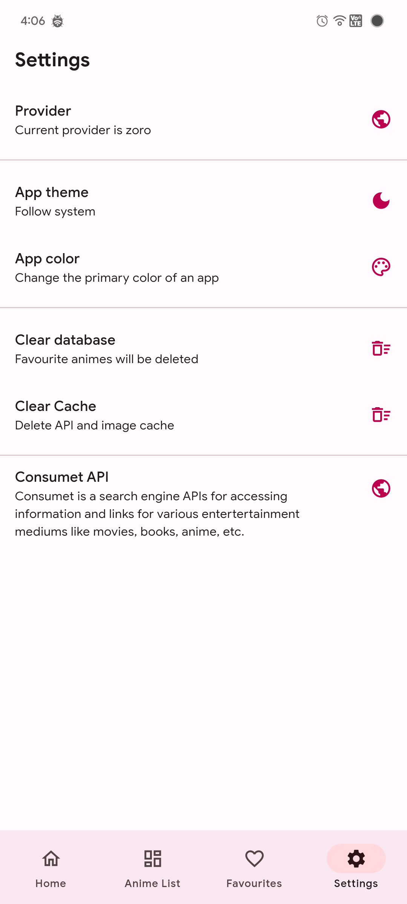
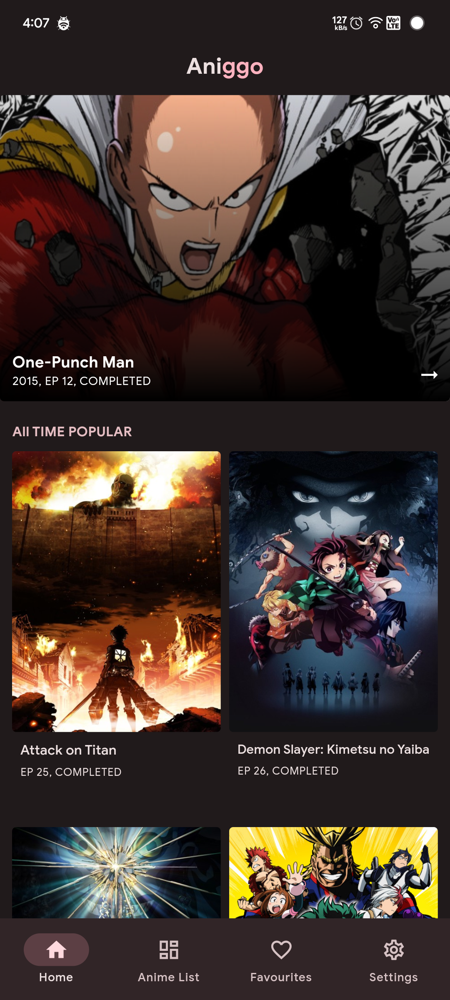
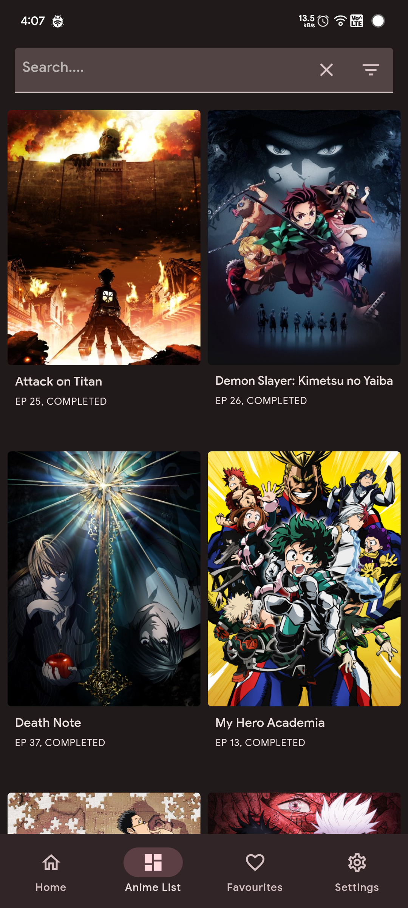
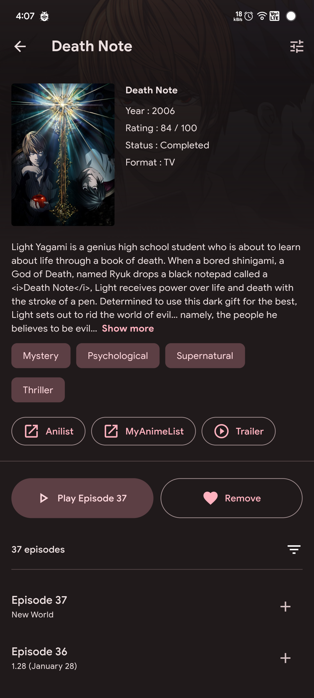
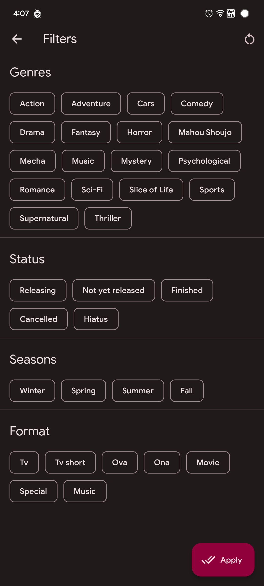
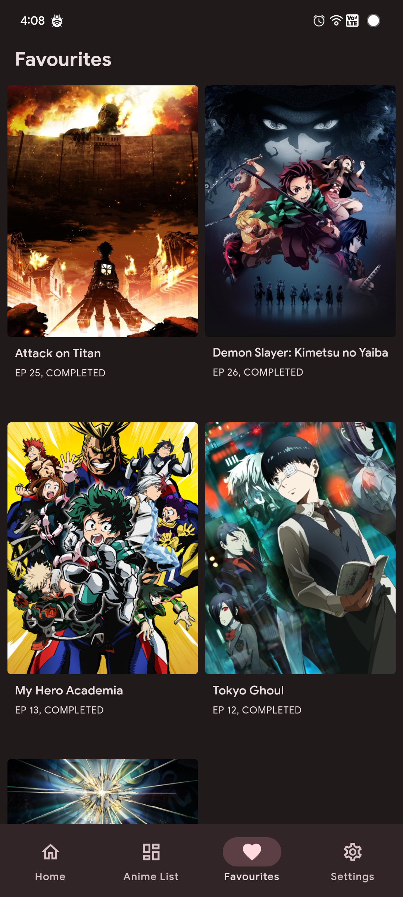
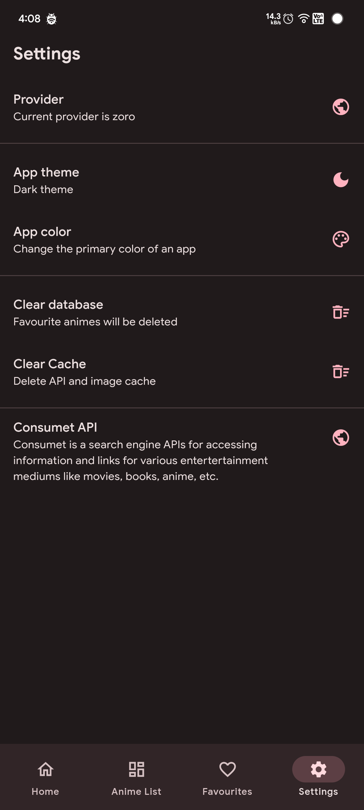

# Aniggo
Anime streaming app built with [Flutter](https://github.com/flutter/flutter) and [Consumet](https://github.com/consumet).

## Features
<ul>
  <li>Multiple provider like zoro, gogo etc</li>
  <li>Advanced search with filters</li>
  <li>Add to favourites</li>
  <li>Mark episodes as watched</li>
  <li>Dark and light mode with multiple accent colors</li>
</ul>

## Screenshots
<table>
  <tr>
    <td>Home Screen</td>
    <td>Anime Detail</td>
    <td>Anime List</td>
  </tr>
  <tr>
    <td></td>
    <td></td>
    <td></td>
  </tr>
  <tr>
    <td>Filter</td>
    <td>Favourites</td>
    <td>Settings</td>
  </tr>
  <tr>
    <td></td>
    <td></td>
    <td></td>
  </tr>
</table>
 

## Screenshots Dark mode
<table>
  <tr>
    <td>Home Screen</td>
    <td>Anime List</td>
    <td>Anime Detail</td>
  </tr>
  <tr>
    <td></td>
    <td></td>
    <td></td>
  </tr>
  <tr>
    <td>Filter</td>
    <td>Favourites</td>
    <td>Settings</td>
  </tr>
  <tr>
    <td></td>
    <td></td>
    <td></td>
  </tr>
</table>
